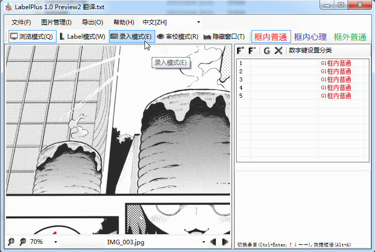
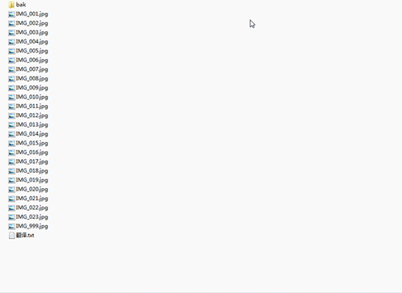

# LabelPlus

LabelPlus\(标号器+\)是一套漫画翻译辅助工具组，目标是：

* 为翻译团队提供工作平台，减少翻译工作各环节的交接成本，实现流程优化
* 自动化部分工作，减少重复劳动

工具包目前包含：

* LabelPlus： Windows软件，免费开源，用于翻译/校对工作 todo：补图

* [萌翻](https://moetra.com)：用于翻译/校对工作，在线团队协作工具，对触摸屏、小屏幕设备支持较好

* PS-Script： 运行于Photoshop的脚本，免费开源；用于嵌字工作，可自动将翻译文本导入Photoshop中，同时完成部分自动化功能，如设置文字格式、执行动作、辅助涂白对话框等等 todo：补图

应用场景除了漫画翻译, 亦适用于各种需要将图片与文字建立关联, 并需要在Photoshop中进一步加工处理的场景, 例如: 翻译游戏中零碎的图片.

**传送门**

* [LablPlus项目主页](http://noodlefighter.com/label_plus)
* [Github上的LabelPlus组织](https://github.com/LabelPlus)

## 了解LabelPlus工作流

### Step1. 翻译工作

**图源**向**翻译**供图, **翻译**在LabelPlus中完成翻译工作：

先在"标号模式"下对需要翻译的位置进行标号，然后在"录入模式"中录入翻译文本，保存得到“翻译文件”，这个文件里描述了标号与文本的对应关系。

### Step2. 校对工作

**翻译**将翻译文件发给**校对**, 在LabelPlus提供的"审校模式"完成校对.

### Step3. 嵌字工作

**嵌字**拿到图源后可以先对图片进行处理，使用LabelPlus的PS脚本可以将**翻译**提供的文本自动导入到图片中.

可见对于嵌字而言，避免了复制/粘贴的工作，减少了嵌错位的可能性, 降低沟通成本。

导入图片可以是Photoshop支持的任意格式，也就是说嵌字在拿到翻译文件前就可以开始修图工作。

而且由于“翻译文件”中，储存的标号位置为图片宽、高的百分比，所以可以随意更换图源。
